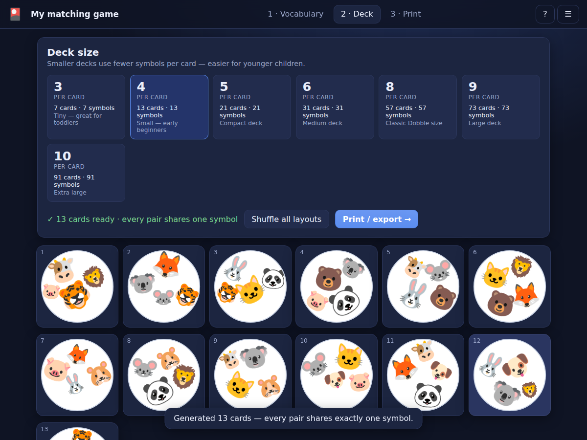

# Card Game Builder

A **Progressive Web App** for making your own *Spot‑It! / Dobble*‑style matching
card games and exporting them as **print‑ready PDFs** — built for language teachers
who want kids to drill vocabulary.

Everything runs in the browser. No account, no server, works offline, and it can be
installed to your home screen like a native app.



## What it does

A Dobble deck has one magic property: **any two cards share exactly one symbol**.
Players race to spot the match. This app builds a mathematically‑correct deck from
your own pictures, so every pair really does share exactly one — guaranteed, at any
size.

- **Vocabulary** — add symbols as emoji, uploaded pictures, or picture + word pairs.
- **Deck sizes** — from tiny (3 symbols per card, 7 cards) up to the classic Dobble
  size (8 per card, 57 cards) and beyond. Smaller decks are easier for younger kids.
- **Round cards** — symbols are packed onto each card at varied sizes and rotations,
  just like the real game, with no overlaps.
- **Print** — tune card diameter, paper size, margins and cut outlines, then download
  a PDF laid out for A4 or US Letter. What you see on screen is exactly what prints.
- **Offline & installable** — a PWA with a service worker; your deck is saved on the
  device and can be exported/imported as a single file (pictures included).

## How the maths works

Cards and symbols are the *lines* and *points* of a finite
[projective plane](https://en.wikipedia.org/wiki/Projective_plane) `PG(2, q)`:

| Order `q` | Symbols per card (`q+1`) | Cards & symbols (`q²+q+1`) |
|-----------|--------------------------|-----------------------------|
| 2 | 3 | 7 |
| 3 | 4 | 13 |
| 4 | 5 | 21 |
| 5 | 6 | 31 |
| 7 | 8 | 57 (classic) |
| 8 | 9 | 73 |
| 9 | 10 | 91 |

A plane exists whenever `q` is a prime power, so the generator uses finite‑field
`GF(q)` arithmetic (`src/lib/gf.ts`) — that is what lets orders 4, 8 and 9 work, not
just the primes. Every generated deck is asserted valid at build time
(`assertValid`), and `npm run verify` re‑proves the property for all sizes.
(Order 6 is deliberately missing: no projective plane of order 6 exists.)

## Tech

Svelte 5 + Vite + TypeScript, `vite-plugin-pwa` for the offline/installable shell,
and `pdf-lib` (lazy‑loaded) for client‑side PDF generation. Uploaded pictures are
kept in IndexedDB; the deck itself autosaves to `localStorage`.

## Develop

```bash
npm install
npm run dev        # dev server
npm run build      # type-check + production build (outputs dist/)
npm run preview    # serve the production build
```

## Tests

```bash
npm test           # verify deck maths (all sizes) + layout has no overlaps
npm run test:e2e   # drive the built app in Chromium: generate a deck, check the
                   # Dobble property from live state, and export a real PDF
npm run icons      # regenerate the PWA icons in public/
```

`test:e2e` needs a running `npm run preview` and a Chromium binary; point it at one
with `CHROME_PATH=/path/to/chrome` (Playwright's bundled Chromium works too).
